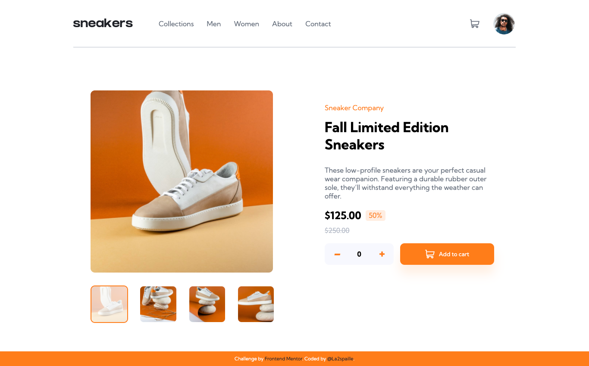

# Frontend Mentor - E-commerce product page solution

This is a solution to the [E-commerce product page challenge on Frontend Mentor](https://www.frontendmentor.io/challenges/ecommerce-product-page-UPsZ9MJp6). Frontend Mentor challenges help you improve your coding skills by building realistic projects.

## Table of contents

- [Overview](#overview)
  - [The challenge](#the-challenge)
  - [Screenshot](#screenshot)
  - [Links](#links)
- [My process](#my-process)
  - [Built with](#built-with)
  - [What I learned](#what-i-learned)
  - [Continued development](#continued-development)
  - [Useful resources](#useful-resources)
- [Author](#author)
- [Acknowledgments](#acknowledgments)

## Overview

### The challenge

Users should be able to:

- View the optimal layout for the site depending on their device's screen size
- See hover states for all interactive elements on the page
- Open a lightbox gallery by clicking on the large product image
- Switch the large product image by clicking on the small thumbnail images
- Add items to the cart
- View the cart and remove items from it

### Screenshot

### Links

- Solution URL: [Solution](https://github.com/la2spaille/E-commerce-product-page-By-La2spaille)
- Live Site URL: [Live Site](https://e-commerce-product-page-by-la2spaille.vercel.app/)

## My process

### Built with

- HTML
- CSS 
- Javascript

### What I learned

I learned a bit more about arrays in Javascript and "forEach" function.

### Continued development

Now I plan to learn more about native JavaScript for future annimation and the BEM method.

### Useful resources

- [Ressource 1](https://css-tricks.com/snippets/css/a-guide-to-flexbox/) - This helped me to make the "input" element have the same heigth as the "Add to cart" button with "align-items: stretch;" css statement.

## Author

- Frontend Mentor - [@la2spaille](https://www.frontendmentor.io/profile/llowii)
- Twitter - [@la2spaille](https://twitter.com/la2spaille?t=DKdFp3xhoD0HMBn9TGa6Rw&s=09)

## Acknowledgments

I wanted to say that this is my first project that I have completed and I am very pround of it.
Thanks to Frontend Mentor!

